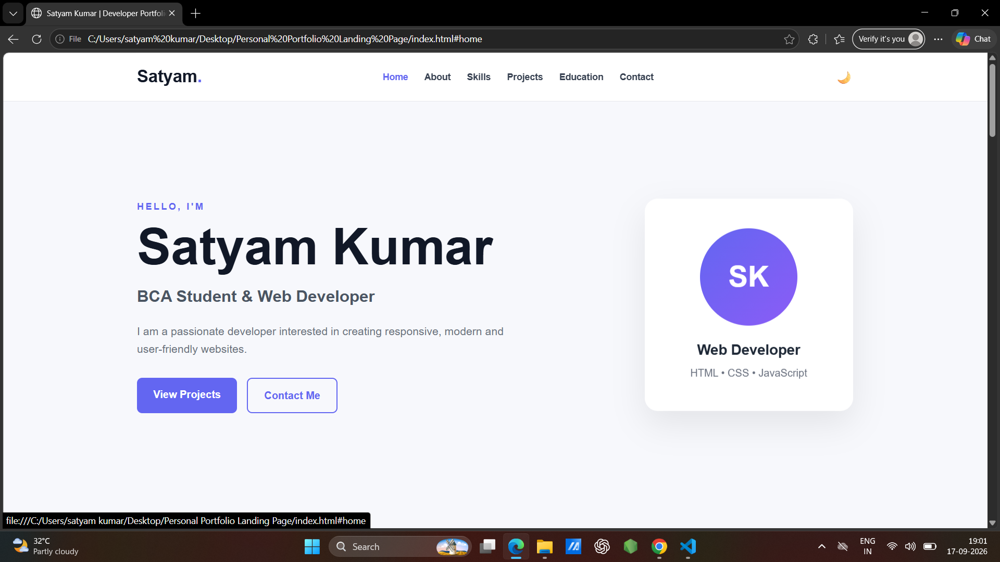
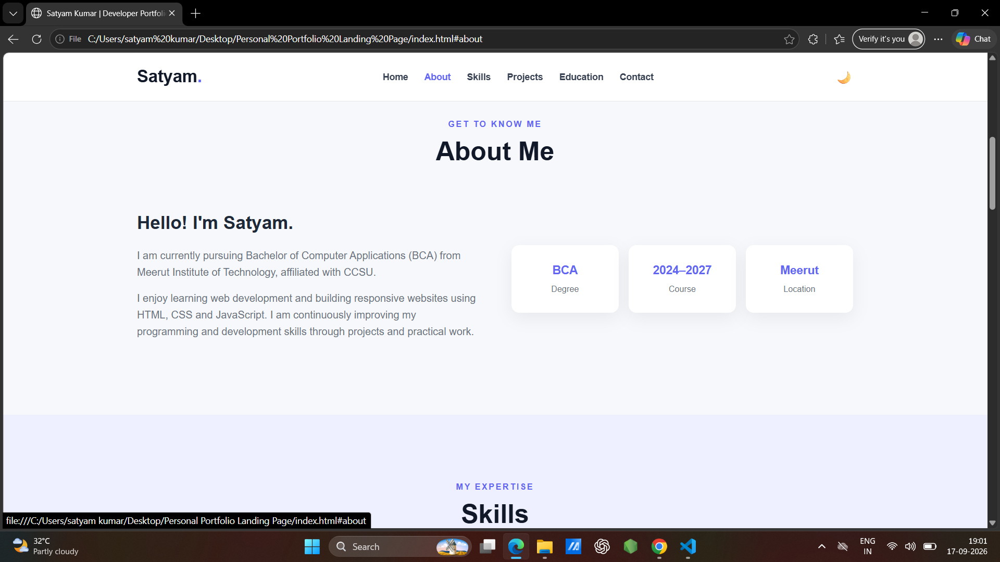
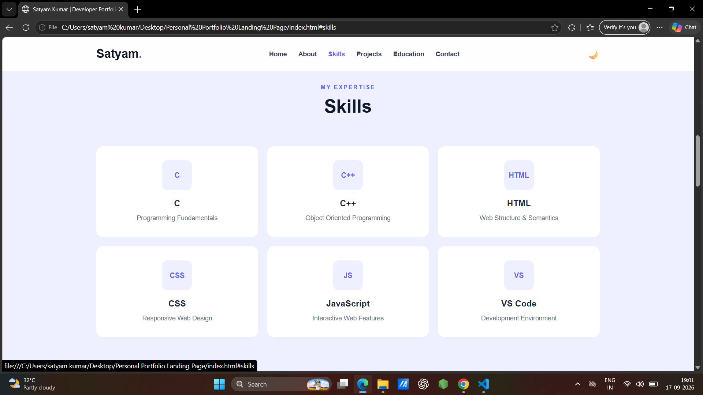
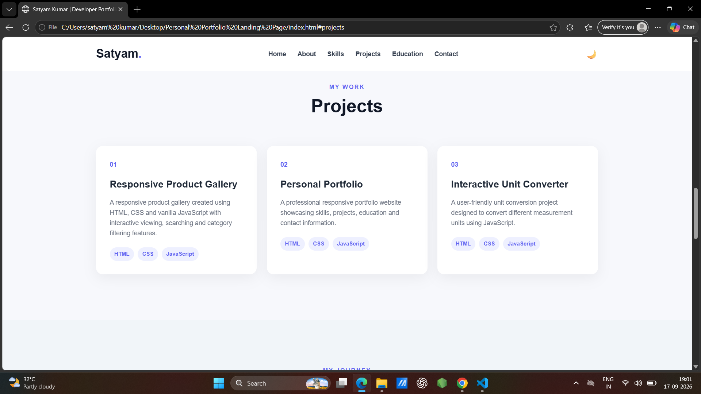
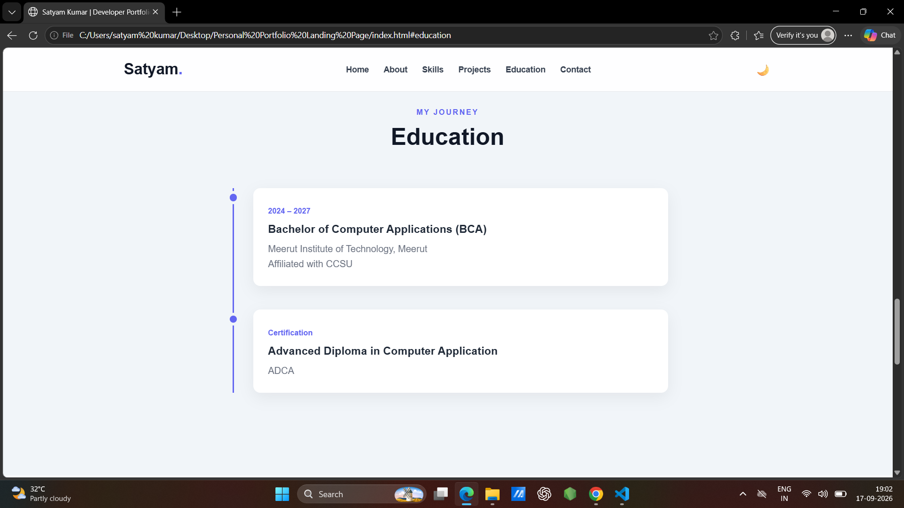
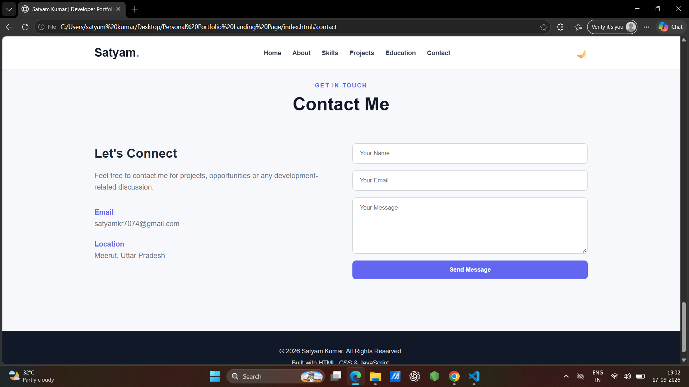

# Personal Portfolio Landing Page

A professional, modern, and fully responsive personal portfolio website created using HTML, CSS, and JavaScript.

The portfolio showcases my introduction, skills, projects, education, resume, and contact information in a clean and user-friendly design.

---

## 👨‍💻 About Me

Hi, I'm **Satyam Kumar**, a BCA student and aspiring Web Developer.

I am currently pursuing **Bachelor of Computer Applications (BCA)** from **Meerut Institute of Technology, Meerut**, affiliated with **CCSU**.

I am interested in web development and enjoy creating responsive and interactive websites using HTML, CSS, and JavaScript.

---

## ✨ Features

- Responsive navigation bar
- Hero / Introduction section
- About Me section
- Skills section
- Projects section
- Education section
- Resume download section
- Contact section
- Contact form validation
- Dark / Light mode
- Smooth scrolling
- Hover effects
- Scroll animations
- Mobile responsive design
- Clean and modern user interface

---

## 🛠️ Technologies Used

- HTML5
- CSS3
- JavaScript
- VS Code

---

## 💻 Skills

- C
- C++
- HTML
- CSS
- JavaScript
- VS Code

---

## 📂 Projects

### 1. Responsive Product Gallery

A responsive product gallery created using HTML, CSS, and JavaScript.

### Main Features

- Responsive gallery layout
- Multiple product cards
- Product images and information
- Category-based filtering
- Search functionality
- Interactive image viewing
- Responsive design for different screen sizes

---

### 2. Personal Portfolio Landing Page

A responsive personal portfolio website designed to showcase my skills, projects, education, resume, and contact information.

### Main Features

- Professional landing page
- Responsive navigation
- Dark / Light theme
- Smooth scrolling
- Hover effects
- Contact form validation
- Mobile-friendly design

---

### 3. Interactive Unit Converter

A simple and interactive unit converter created using HTML, CSS, and JavaScript.

The project provides an easy-to-use interface for converting different measurement units.

---

## 🎓 Education

### Bachelor of Computer Applications (BCA)

**Meerut Institute of Technology, Meerut**  
Affiliated with **CCSU**  
**Course Duration:** 2024 – 2027

---

## 📜 Certification

**Advanced Diploma in Computer Application (ADCA)**

---

## 📄 Resume

A resume download option is provided on the portfolio website.

The resume can be downloaded directly using the **Download Resume** button.

---

## 📸 Screenshots

### Home



---

### About



---

### Skills



---

### Projects



---

### Education



---

### Contact



---

## 📁 Project Structure

```text
Personal Portfolio/
│
├── index.html
├── style.css
├── script.js
├── README.md
├── resume.pdf
│
└── screenshots/
    ├── home.png
    ├── about.png
    ├── skill.png
    ├── project.png
    ├── education.png
    └── contact.png